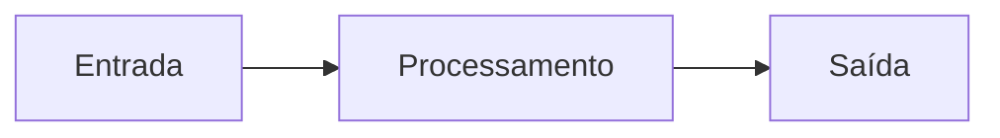
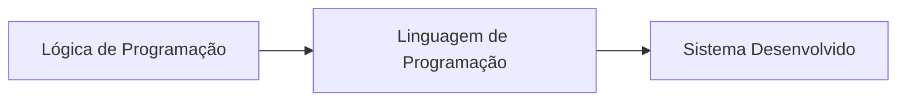
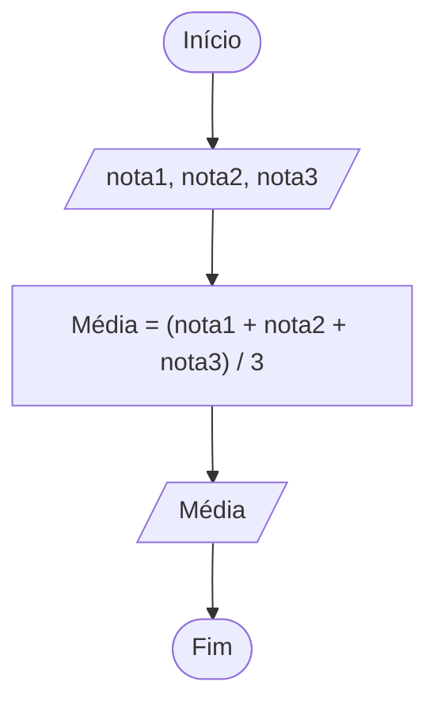

# Aula 01 — Lógica de Programação

## Algoritmos

### O que é algoritmo?

- Algoritmo é um conceito simples, utilizado por nós, diariamente.
- Um algoritmo pode ser compreendido como um plano, traçado e seguido por nós, para realizar uma atividade do dia a dia:
  - Fazer compras;
  - Preparar um bolo;
  - Trocar uma lâmpada;
  - Atravessar a rua.
- Para todas essas atividades, há um algoritmo que define como vamos realizá-las com sucesso.

---

- Segundo Manzano, um dos autores mais famosos sobre o assunto de algoritmos:

  > **Algoritmos** são conjuntos de passos **finitos** e **organizados** que quando executados, resolvem um determinado **problema**.

- Basicamente, podemos comparar um algoritmo a um roteiro, uma receita ou um plano, que mostra, passo a passo, o que deve ser feito para a resolução de uma tarefa.

---

### Como seria um algoritmo para atravessar a rua?

### E para trocar uma lâmpada?

---

- O conceito de um algoritmo vai muito além dos computadores.
- Embora não percebamos, em atividades corriqueiras de nossas vidas, realizamos tarefas que se encaixam no conceito de algoritmo. Para a realização das atividades abaixo, por exemplo, executamos os seguintes passos:

**Trocar uma Lâmpada**
```text
Início
1. pegamos uma escada;
2. posicionamos a escada debaixo da lâmpada;
3. buscamos uma lâmpada nova;
4. acionamos o interruptor;
5. se a lâmpada não acender, então:
6.     subimos na escada;
7.     retiramos a lâmpada queimada;
8.     colocamos a lâmpada nova;
Fim
```

**Atravessar a Rua**
```text
Início
1. olhamos para direita;
2. olhamos para esquerda;
3. se estiver vindo carro:
4.     não atravessamos;
5. senão:
6.     atravessamos;
Fim
```

---

- Este pode ser considerado um algoritmo?

**Trocar uma Lâmpada** *(fora de ordem)*
```text
Início
1. colocamos a lâmpada nova;
2. retiramos a lâmpada queimada;
3. buscamos uma lâmpada nova;
4. acionamos o interruptor;
5. se a lâmpada não acender, então:
6.     subimos na escada;
7.     pegamos uma escada;
8.     posicionamos a escada debaixo da lâmpada;
Fim
```

---

- Observando, podemos ver que essas **descrições** sobre como trocar a lâmpada e como atravessar a rua são algoritmos, pois são passos **organizados** que realizam uma tarefa com **sucesso**.
  - Quando a **descrição** não conseguir realizar a tarefa com sucesso (ou seja, não resolvendo o problema), ela não é considerada como um algoritmo.

> **Nota:** essa sequência de passos (exemplo da lâmpada fora de ordem) não está mais na ordem correta.

---

## Algoritmos Computacionais

Basicamente, um **Algoritmo Computacional** é uma sequência de passos que é executada por um computador, geralmente com o auxílio de um usuário, e efetua um processamento para realizar alguma determinada tarefa.



- **Entrada:** informações necessárias para que o ALGORITMO possa ser executado.
- **Processamento:** avaliadas todas as expressões algébricas, relacionais e lógicas, assim como todas as estruturas de controle existentes no algoritmo (condição e/ou repetição).
- **Saída:** todos os resultados do processamento (ou parte deles) são enviados para um ou mais dispositivos de saída.

---

## Nem todo algoritmo é computacional...

- Qual a diferença entre um algoritmo computacional e um algoritmo que seguimos para realizar alguma atividade do dia a dia?
  - Enquanto traçamos um plano para realizar alguma atividade, podemos usar qualquer expressão para ilustrar que atividades devemos executar.
  - Os algoritmos computacionais são escritos respeitando um conjunto pré-estabelecido de "palavras" que podem ser utilizadas (isso é o que chamamos de **sintaxe** da linguagem).
- Dessa forma, a maioria dos algoritmos não computacionais são sequências de passos que, a princípio, não podem ser executadas por um computador.

---

## Como os Algoritmos Computacionais são Criados?

- Todo algoritmo computacional começa com o desenvolvimento da **lógica de programação**, que simplesmente são ideias que temos para resolvermos determinado problema.
- A partir dessa lógica, é preciso escrevê-la em alguma **linguagem de programação**, como JavaScript, Java, C#, PHP etc.
- E essa linguagem de programação vai ser utilizada para criar um **sistema completo**, que é a aplicação que seu usuário vai utilizar.

### Então, todo sistema computacional nasce assim:



- Uma lógica de programação é desenvolvida na cabeça de um programador, analista ou uma equipe de desenvolvimento; essa lógica é estruturada em uma linguagem de programação para que no final resulte em um sistema (programa de computador).

---

## Lógica de Programação

- No dia a dia, quando nos deparamos com problemas, geralmente, antes de efetivamente resolvê-los, precisamos pensar em **como** resolvê-los. Essa reflexão é essencial para resolver o problema corretamente.
- A lógica de programação é a técnica de encadear pensamentos, que permite definir uma sequência de passos para atingir determinado objetivo, ou seja, resolver um problema.

### Para se representar a lógica de programação, podemos usar várias ferramentas, dentre as mais famosas estão:

- **Fluxograma**
- **Pseudocódigo (ou Portugol)**

**Exemplo de Pseudocódigo (Portugol):**
```text
algoritmo "BoasVindas"
// Função :
// Autor :
// Data : 08/04/2013
// Seção de Declarações
var
   nome: CARACTERE
inicio
// Seção de Comandos
   ESCREVA ("Olá! Digite o seu nome: ")
   LEIA (nome)
   ESCREVA ("Seja bem vindo ", nome, "!")
fimalgoritmo
```

---

## Fluxograma

- O fluxograma representa graficamente a lógica, através de um fluxo de ações, que vai de um ponto (início) a outro (fim). As ações são representadas por desenhos geométricos, os quais indicam a entrada, o processamento e a saída de dados.
- Exemplo — algoritmo de cálculo de média, onde as **entradas** são as notas, depois elas são **processadas** e o valor é igual à média, por fim a **saída** dessa média é impressa na tela:



| Elemento | Símbolo do Fluxograma | Papel |
|---|---|---|
| Início/Fim | Retângulo arredondado | Delimita o algoritmo |
| Entrada | Paralelogramo | Dados fornecidos (nota1, nota2, nota3) |
| Processamento | Retângulo | Cálculo (Média = (nota1+nota2+nota3)/3) |
| Saída | Paralelogramo | Resultado exibido (Média) |
